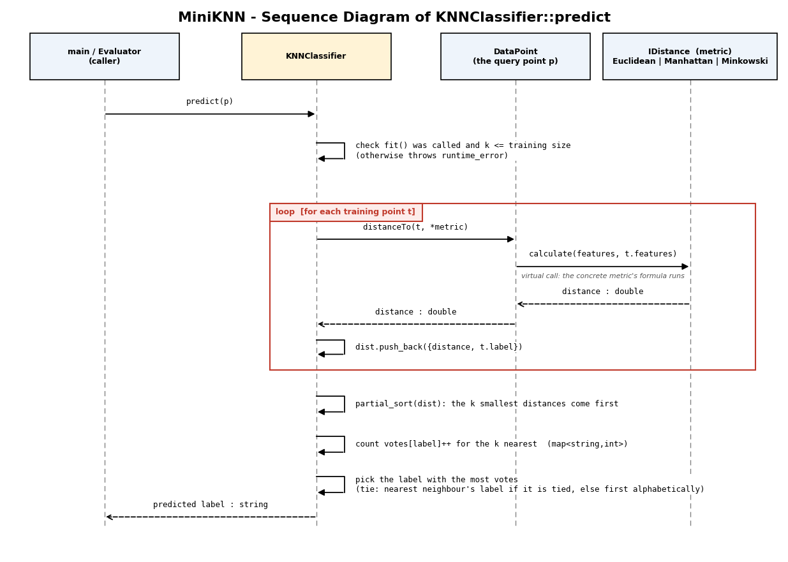

# MiniKNN Documentation

This document explains how MiniKNN is built: its architecture, each class, how `predict` works, the design decisions behind it and how errors are handled. For build steps and a quick tour, see [`README.md`](README.md).

## 1. Overview

MiniKNN classifies a data point with K-Nearest Neighbours: it finds the *k* training points closest to the new point and returns the label most of them share.

The code is split into five layers, so each class has one job.

| Layer | Classes | Job |
|---|---|---|
| Data | `DataPoint`, `DataSet` | Hold and load the data |
| Distance | `IDistance`, `EuclideanDistance`, `ManhattanDistance`, `MinkowskiDistance` | Measure how close two points are |
| Classifier | `KNNClassifier` | Learn from training data and predict labels |
| Tools | `Evaluator`, `Normalizer`, `KSelector` | Split data, measure accuracy, scale features, choose `k` |
| Program | `main.cpp` | Menu that wires everything together |

## 2. Class Reference

### DataPoint
One row of data.
- `vector<double> features`: the numeric values.
- `string label`: the class name. It is empty for an unlabelled point.
- `distanceTo(other, metric) const`: returns `metric.calculate(features, other.features)`. The metric is passed in, so `DataPoint` does not depend on any particular formula.
- `print() const`: prints the point as `[f1, f2, ...] -> label`.

### DataSet
A collection of `DataPoint`s.
- `vector<DataPoint> points`
- `loadCSV(path)`: reads a CSV with exactly 5 columns per row (4 numbers and a label, no header). It throws `runtime_error` if the file cannot be opened, a row does not have 5 columns, a value is not a valid number or is out of range, or no rows were loaded.
- `size() const`, `print() const`.

### IDistance (abstract interface)
- `virtual double calculate(a, b) const = 0`
- `virtual ~IDistance() = default`: the virtual destructor makes sure the right destructor runs when a metric is deleted through an `IDistance` pointer.

### EuclideanDistance, ManhattanDistance, MinkowskiDistance
Each implements `calculate` and throws `invalid_argument` if the two vectors have different sizes.

| Class | Formula |
|---|---|
| `EuclideanDistance` | $d(a,b) = \sqrt{\sum_{i=1}^{n} (a_i - b_i)^2}$ |
| `ManhattanDistance` | $d(a,b) = \sum_{i=1}^{n} \lvert a_i - b_i \rvert$ |
| `MinkowskiDistance(p)` | $d(a,b) = \left( \sum_{i=1}^{n} \lvert a_i - b_i \rvert^p \right)^{1/p}, \quad p \geq 1$ |

`MinkowskiDistance` is the general case: `p = 1` gives Manhattan and `p = 2` gives Euclidean. Its constructor is `explicit` and throws `invalid_argument` if `p < 1`.

### KNNClassifier
- Private members: `int k`, `unique_ptr<IDistance> metric`, `DataSet trainingData`.
- `KNNClassifier(k, metric)`: throws `invalid_argument` if `k <= 0` or the metric is null. Takes the metric by `unique_ptr`, so the classifier becomes its only owner.
- `fit(data)`: throws `invalid_argument` if the data is empty, otherwise stores a copy.
- `predict(p) const`: see section 3.

### Evaluator (static utilities)
- `trainTestSplit(data, trainRatio, seed)`: copies the data, shuffles it with `mt19937(seed)` and cuts it into a training set and a test set. It always leaves at least one row in each set. It throws `invalid_argument` for an empty dataset or a ratio outside 0 to 1.
- `accuracy(classifier, testData)`: the fraction of test points whose predicted label equals the true label. Throws `invalid_argument` for empty test data.
- `confusionMatrix(classifier, testData)`: a `map<actual, map<predicted, count>>`.
- `printConfusionMatrix(matrix)`: prints it as a table, rows are the actual labels and columns the predicted ones.

### Normalizer
Min-max scaling: each feature value becomes `(value - min) / (max - min)`, so every feature lies between 0 and 1.
- `fit(data)`: learns the minimum and maximum of each feature. Throws `invalid_argument` for an empty dataset or points with different feature counts.
- `transform(DataSet)` and `transform(DataPoint)`: apply the learned scale. They throw `runtime_error` if `fit` has not been called, and `invalid_argument` if the feature count differs. A feature that is constant in the training data becomes 0.
- `fitTransform(data)`: `fit` then `transform` in one step.

### KSelector (static utility)
`findBestK(train, candidates, makeMetric, folds = 5, seed = 42)` returns the candidate `k` with the best cross-validated accuracy.
- It shuffles the training data with the seed and splits it into `folds` parts. For each candidate, every part takes a turn as the validation set while the rest trains a fresh `KNNClassifier`.
- `makeMetric` is a function that returns a new `unique_ptr<IDistance>`. A factory is needed because a `unique_ptr` cannot be copied, so each classifier must get its own metric.
- Candidates that are not positive or are larger than the training part are skipped. When two candidates tie, the one that comes first in the list wins.
- It throws `invalid_argument` for no candidates, fewer than 2 folds or fewer data rows than folds, and `runtime_error` if no candidate is valid.

## 3. How `predict` Works

1. **Validate.** If `fit` was never called, or `k` is larger than the training set, throw `runtime_error`.
2. **Measure.** For every training point `t`, compute `p.distanceTo(t, *metric)`. This calls `IDistance::calculate` through the pointer, so the concrete metric's formula runs (polymorphism). Store `{distance, t.label}` in a vector.
3. **Select.** `partial_sort` moves the *k* smallest pairs to the front. This is cheaper than sorting everything, because only the *k* nearest matter. Pairs with exactly equal distances are ordered by label.
4. **Vote.** Count the labels of the first *k* pairs in a `map<string, int>`.
5. **Decide.** Return the label with the most votes. If several labels tie for the most votes, the label of the nearest neighbour wins when it is one of the tied labels. If it is not, the alphabetically first tied label wins.

The cost of one prediction is about `n * d` for the distances (`n` training points, `d` features) plus `n log k` for the partial sort.

## 4. Design Decisions

- **Strategy pattern for distance.** `KNNClassifier` depends on the `IDistance` interface, never on a formula. Adding a metric means writing one new class and changing nothing else.
- **Composition with `unique_ptr`.** The classifier owns its metric. `unique_ptr` expresses exclusive ownership and frees the memory automatically (RAII). A pointer is needed because `IDistance` is abstract and cannot be stored by value.
- **Virtual destructor.** Without it, deleting a metric through an `IDistance` pointer would be undefined behaviour.
- **`const&` parameters.** `predict`, `distanceTo`, `fit` and the `Evaluator` functions take their arguments by `const` reference, which avoids copies and promises not to modify them.
- **`fit` copies the data.** This is simple and safe, and 150 rows is tiny. A reference would avoid the copy but could dangle if the original dataset were destroyed.
- **Shuffle with a fixed seed.** Iris is stored sorted by species, so splitting without shuffling would put whole species only in the test set. The fixed seed (42) makes every run give the same split and the same accuracy.
- **Normalise using the training data only.** The scale is learned from the training set and then applied to the test set and to any new point. Learning it from the test data would leak information about it into the model (data leakage). Normalising matters because KNN is distance-based: a feature with a large range would otherwise dominate.
- **Utility classes with static functions.** `Evaluator` and `KSelector` hold no state, so their functions are static. `Normalizer` holds state (the learned minimums and maximums), so it is a normal class.
- **Exceptions for errors.** Invalid arguments and invalid states throw `invalid_argument` or `runtime_error` with a clear message. `main` catches them, so the program never crashes on bad input.

## 5. Program Flow (`main.cpp`)

1. Load the CSV (path from the first command-line argument, default `data/iris.csv`).
2. Split 80/20 with seed 42.
3. Fit the `Normalizer` on the training set, then scale both sets.
4. Show the menu in a loop. Each choice builds a fresh `KNNClassifier` from the current settings (metric, `p`, `k`), fits it on the scaled training data and uses it.
5. Every menu action is wrapped in `try/catch`, so an error in one action prints a message and returns to the menu.

Input is read line by line and checked. A wrong entry is rejected and asked again, and if the input stream ends the program exits cleanly.

## 6. Error Handling Summary

| Situation | Where | Result |
|---|---|---|
| CSV file missing | `DataSet::loadCSV` | `runtime_error`, program exits with an error message |
| CSV row has the wrong number of columns, or a non-numeric value | `DataSet::loadCSV` | `runtime_error` naming the line number |
| `k <= 0` or null metric | `KNNClassifier` constructor | `invalid_argument` |
| Empty training data | `KNNClassifier::fit` | `invalid_argument` |
| `predict` before `fit`, or `k` larger than the training set | `KNNClassifier::predict` | `runtime_error` |
| Vectors of different lengths | all distance classes | `invalid_argument` |
| `p < 1` for Minkowski | `MinkowskiDistance` constructor | `invalid_argument` |
| `transform` before `fit` | `Normalizer` | `runtime_error` |
| Invalid split ratio or empty data | `Evaluator::trainTestSplit` | `invalid_argument` |
| Typing text where a number is expected, or a value out of range | `main.cpp` menu | Rejected and asked again |

## 7. Data Format

`data/iris.csv` has 150 rows and no header. Each row is `sepal length, sepal width, petal length, petal width, label`, for example `5.1,3.5,1.4,0.2,Iris-setosa`. Another dataset can be used if it has exactly the same shape (4 numeric columns and a label).

## 8. Extending the Library

**Adding a new distance metric** (for example Chebyshev):
1. Create `include/ChebyshevDistance.h` with a class that inherits from `IDistance` and declares `calculate`.
2. Implement `calculate` in `src/ChebyshevDistance.cpp`.
3. Pass `make_unique<ChebyshevDistance>()` to `KNNClassifier`. Nothing else changes. To offer it in the menu, add one case to `makeMetric` and `metricName` in `main.cpp`.

## 9. Known Limitations

- `loadCSV` only accepts exactly 5 columns, so it is tied to the Iris format.
- The split is a plain random split, not stratified, so a small test set may contain few points of one species.
- `predict` computes the distance to every training point, which is fine for 150 rows but would be slow for large datasets.
- Voting is unweighted: every one of the *k* neighbours counts equally, however far away it is.
