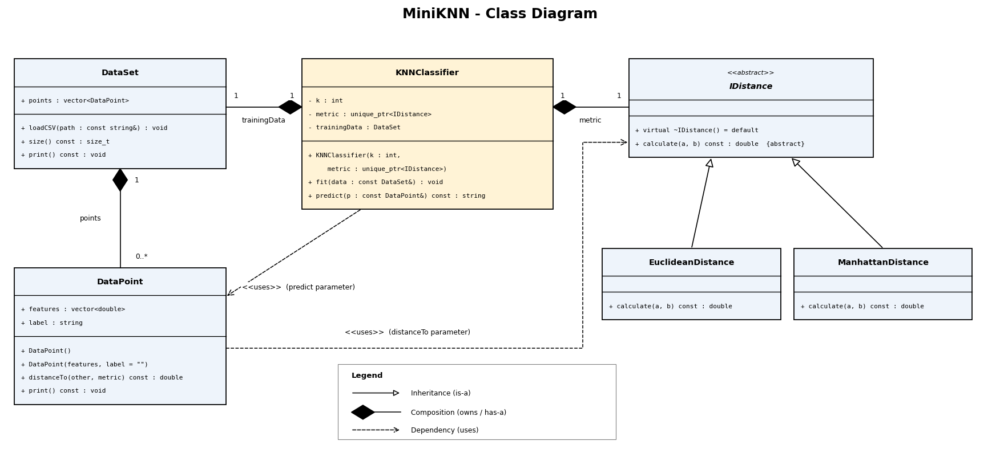

# MiniKNN

**KNN Classifier Library - C++ OOP Project**

MiniKNN is a small C++17 library that classifies a data point with the K-Nearest Neighbours algorithm. It comes with a menu-driven program that classifies Iris flowers, measures accuracy and compares distance metrics.

## Problem Summary

K-Nearest Neighbours (KNN) classifies a new point by looking at the *k* closest labelled points in the training data and returning the label most of them share (majority vote).

The distance formula is not hardcoded. It is a swappable component behind an interface (`IDistance`), so the classifier can use Euclidean, Manhattan or Minkowski distance without changing its own code.

**Dataset:** Iris, 150 rows. Each row has 4 numeric features (sepal length, sepal width, petal length, petal width) and a label (`Iris-setosa`, `Iris-versicolor` or `Iris-virginica`).

## Features

- Three interchangeable distance metrics: Euclidean, Manhattan and Minkowski (any `p >= 1`)
- Train/test split with a shuffle and a fixed seed, so results are repeatable
- Min-max normalisation, learned from the training data only
- Accuracy and confusion matrix
- Automatic choice of `k` using 5-fold cross-validation
- Menu program that survives bad input (typos, out-of-range values, missing files)

## Build

You need g++ with C++17 support (MinGW on Windows, or GCC on Linux). Run these from the project root folder.

**Option 1: Makefile**
```
make
```

**Option 2: g++ directly**
```
g++ -std=c++17 -Iinclude src/*.cpp -o miniknn
```

## Run

```
./miniknn                  # uses data/iris.csv
./miniknn path/to/file.csv # use another CSV file in the same format
```

Run it from the project root, because the default path `data/iris.csv` is relative.

### Menu

| Option | What it does |
|---|---|
| 1 | Choose the distance metric (Euclidean, Manhattan, or Minkowski with your own `p`) |
| 2 | Set `k` |
| 3 | Show accuracy and the confusion matrix on the test set |
| 4 | Classify a flower from measurements you type in |
| 5 | Find the best `k` automatically (cross-validation) |
| 0 | Exit |

### Sample output

```
Loaded 150 rows from data/iris.csv.
Train: 120 rows, Test: 30 rows.

==================== MiniKNN ====================
Current: Euclidean, k = 5
  1. Choose distance metric
  2. Set k
  3. Show accuracy on the test set
  4. Classify a custom flower
  5. Find the best k automatically
  0. Exit
Your choice: 3

Metric: Euclidean, k = 5
Test rows: 30
Accuracy: 86.67%

Confusion matrix (rows = actual, columns = predicted):
Actual \ Predicted  Iris-setosa         Iris-versicolor     Iris-virginica
Iris-setosa         7                   0                   0
Iris-versicolor     0                   13                  1
Iris-virginica      0                   3                   6

Your choice: 5

Trying k = 1, 3, 5, ... 15 with 5-fold cross-validation on the training data...
Best k for Euclidean: 3 (k has been set to 3).

Your choice: 4

Enter the measurements of the flower:
  Sepal length (cm): 6.7
  Sepal width (cm): 3.0
  Petal length (cm): 5.2
  Petal width (cm): 2.3
Predicted species: Iris-virginica  (Euclidean, k = 3)
```

## Design

### Classes

| Class | Role |
|---|---|
| `DataPoint` | One row of data: a `vector<double>` of features and a `string` label. `distanceTo(other, metric)` measures the distance to another point using any `IDistance`. |
| `DataSet` | A collection of `DataPoint`s. Loads the CSV file with `loadCSV(path)`. |
| `IDistance` | Abstract interface for a distance metric: `calculate(a, b)`. |
| `EuclideanDistance` | Straight-line distance. |
| `ManhattanDistance` | Sum of absolute differences. |
| `MinkowskiDistance` | Generalises the two above through a parameter `p` (`p = 1` is Manhattan, `p = 2` is Euclidean). |
| `KNNClassifier` | Holds `k`, a metric (`unique_ptr<IDistance>`) and the training data. `fit(data)` stores the training set and `predict(p)` returns the majority label of the *k* nearest neighbours. |
| `Evaluator` | Static utilities: `trainTestSplit`, `accuracy`, `confusionMatrix`, `printConfusionMatrix`. |
| `Normalizer` | Min-max scaling to the range 0 to 1: `fit`, `transform`, `fitTransform`. |
| `KSelector` | Static utility `findBestK` that picks `k` by k-fold cross-validation. |

### Relationships

- `EuclideanDistance`, `ManhattanDistance` and `MinkowskiDistance` inherit from `IDistance`.
- `DataSet` owns many `DataPoint`s (composition).
- `KNNClassifier` owns its `IDistance` metric and its training `DataSet` (composition).
- `KNNClassifier::predict` and `DataPoint::distanceTo` use a `DataPoint` and an `IDistance` as parameters (dependency).
- `Evaluator`, `Normalizer` and `KSelector` work on `DataSet`s and `KNNClassifier`s without owning them (dependency).



The sequence of calls inside `predict` is in [`docs/sequence_diagram.png`](docs/sequence_diagram.png).

### OOP concepts demonstrated

- **Abstraction:** `IDistance` defines what a metric does, not how.
- **Inheritance:** the three metrics extend `IDistance`.
- **Polymorphism:** `KNNClassifier` calls `calculate()` through an `IDistance` pointer, and the right formula runs at runtime (Strategy pattern).
- **Composition:** `KNNClassifier` owns its metric and training data.
- **Encapsulation:** `KNNClassifier` and `Normalizer` keep their state private.
- **RAII / smart pointers:** `unique_ptr` manages the metric's memory automatically.

## Folder Structure

```
MiniKNN/
├── data/
│   └── iris.csv
├── docs/
│   ├── class_diagram.png
│   └── sequence_diagram.png
├── include/
│   ├── DataPoint.h
│   ├── DataSet.h
│   ├── IDistance.h
│   ├── EuclideanDistance.h
│   ├── ManhattanDistance.h
│   ├── MinkowskiDistance.h
│   ├── KNNClassifier.h
│   ├── Evaluator.h
│   ├── Normalizer.h
│   └── KSelector.h
├── src/
│   ├── DataPoint.cpp
│   ├── DataSet.cpp
│   ├── EuclideanDistance.cpp
│   ├── ManhattanDistance.cpp
│   ├── MinkowskiDistance.cpp
│   ├── KNNClassifier.cpp
│   ├── Evaluator.cpp
│   ├── Normalizer.cpp
│   ├── KSelector.cpp
│   └── main.cpp
├── Makefile
├── README.md
└── DOCUMENTATION.md
```

## Team

| Member | Part |
|---|---|
| Harsh Vaghasiya | Data layer (`DataPoint`, `DataSet`, `iris.csv`), evaluation and data tools (`Evaluator`, `Normalizer`) |
| Deep Vekariya | Distance layer (`IDistance`, `EuclideanDistance`, `ManhattanDistance`, `MinkowskiDistance`), classifier core (`KNNClassifier.cpp`) |
| Sanyam Kocher | Classifier interface (`KNNClassifier.h`), program and build file (`main.cpp`, `Makefile`), README and sequence diagram |
